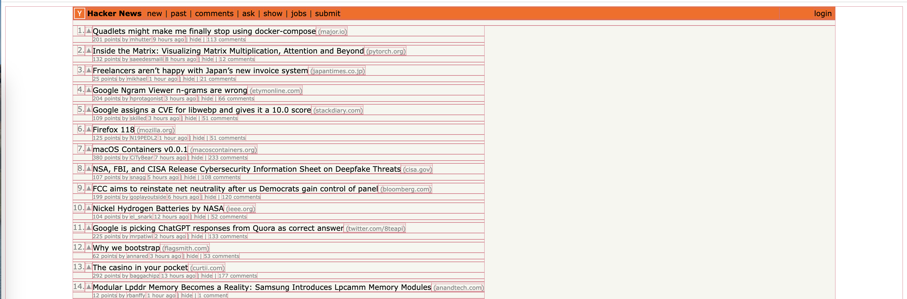

  

## BoxMode

A chrome browser extension that adds boxes that outlines all HTML elements in a page to better understand the design and layout.

  

#### Instructions

To use this extension follow these instructions:

1. Clone this github repo locally

2. Load the extenstion into your chrome browser following [Loading an unpacked extension](https://developer.chrome.com/docs/extensions/mv3/getstarted/development-basics/#load-unpacked).

3. Pin the extension to your extensions menu following [Pinning the extension](https://developer.chrome.com/docs/extensions/mv3/getstarted/development-basics/#pin).

4. Visit any webpage and then click the extension icon from the extensions menu. Voilà!
